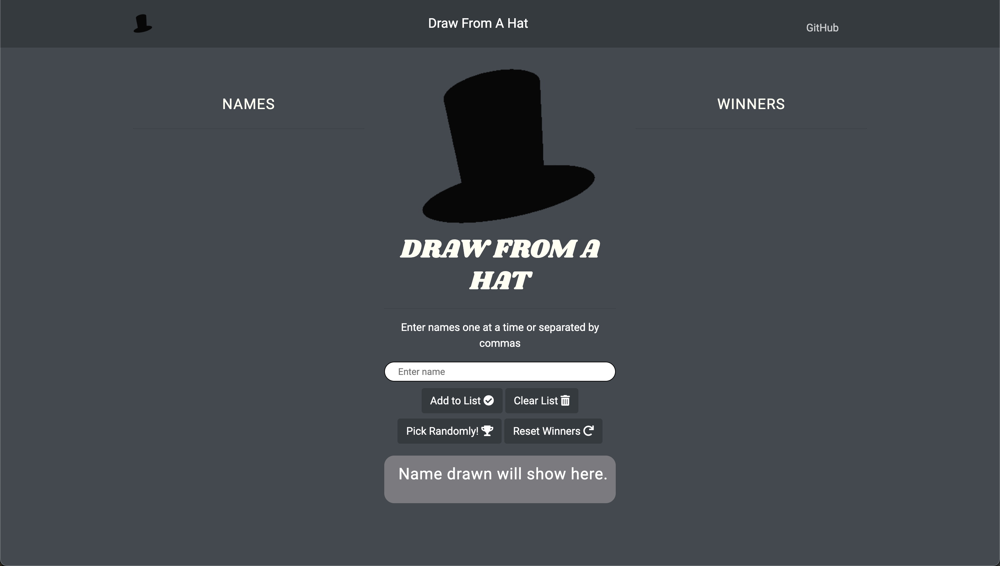

# Table of Contents
1. [Draw from a hat](#Draw-from-a-hat)
2. [Description](#description)
3. [Insructions to Run Locally](#instructions-to-run-locally)
4. [Instructions on Contributing](#Instructions-on-Contributing)
5. [Contributors](#Contributors)
6. [Contact](#Contact)
7. [License](#license)

# Draw from a hat

## Description

This project started as something to implement some basic knowledge I was picking up on Javascript. It was plain and a little vanilla that needed some personal touches so I uploaded it on Github hoping that the vast community could pitch in with some of their ideas.   

This projects uses Javascript, HTML, and CSS to allow users to add a list of names to a hat and randomly select a winner. 

The list of avabile names are displayed on the left column and can removed individually or all at once.

The list of winners names are displayed on the right column and can be cleared all at once.

Check out the [live page](https://yirano.github.io/drawFromAHat/src/) and see what changes you could contribute!

## Instructions to Run Locally

  If using VSCode we suggest installing a plugin to help run the html site locally, some suggested plugins:

  1. Code Runner
  2. Live Server

  After those plugins are installed you can click the play button in the upper right hand corner to run a local instance of the project.

  If you are not using VSCode we have an alertnative method to running a local instance.

  1. Make sure you have node installed 

  2. Enter the drawFromAHat directory folder through the terminal  
      Be sure to to stay in the parent directory to make sure all assets load into the html site.

  3. Type the command npx http-server

  4. A local instance on localhost:8000 should spin up

## Instructions on Contributing

  1. Clone this repo using https://github.com/yirano/drawFromAHat.git/  

  2. Checkout a feature branch: git checkout -b feature-yourfeature

  3. Hack away and implement your changes. 

  4. Commit your changes: git commit -m 'Added feature'.

  5. Push your changes to the branch: git push origin feature-yourfeature

  6. Make a pull request.  
     
     - Check out the [Issues](https://github.com/yirano/drawFromAHat/issues) if you need some ideas.
   
      **[!Important]** Title your pull request describing the changes and/or features you have added. 

  7. Add your name below under "Contributors" with a link to your Github profile using correct Markdown format.

## Contributors

  * [Tiffany Arellano](https://github.com/yirano)
  * [Mohamed Yasser](https://github.com/MohamedYasser97)
  * [Fogha Armand](https://github.com/Fogha)
  * [jbs](https://github.com/lordjbs)
  * [flarefpv](https://github.com/flarefpv)
  * [Mat](https://github.com/alvinmatias69)
  * [Jon](https://github.com/jonmoon74)
  * [Peter](https://github.com/ppgeyser)
  * [Adryn](https://github.com/adriennelim)
  * [Hannah](https://github.com/hannahlivnat)
  * [Timothy Ndiritu](https://github.com/timothyndiritu)
  * [Maxmilian Pennisi](https://github.com/mpennisi498)

## Contact

For any questions or concerns, feel free to reach out to me on Twitter:

[@yirano](https://twitter.com/yirano)

## License

Permission is hereby granted, free of charge, to any person obtaining a copy of this software and associated documentation files (the “Software”), to deal in the Software without restriction, including without limitation the rights to use, copy, modify, merge, publish, distribute, sublicense, and/or sell copies of the Software, and to permit persons to whom the Software is furnished to do so, subject to the following conditions:

The above copyright notice and this permission notice shall be included in all copies or substantial portions of the Software.

THE SOFTWARE IS PROVIDED “AS IS”, WITHOUT WARRANTY OF ANY KIND, EXPRESS OR IMPLIED, INCLUDING BUT NOT LIMITED TO THE WARRANTIES OF MERCHANTABILITY, FITNESS FOR A PARTICULAR PURPOSE AND NONINFRINGEMENT. IN NO EVENT SHALL THE AUTHORS OR COPYRIGHT HOLDERS BE LIABLE FOR ANY CLAIM, DAMAGES OR OTHER LIABILITY, WHETHER IN AN ACTION OF CONTRACT, TORT OR OTHERWISE, ARISING FROM, OUT OF OR IN CONNECTION WITH THE SOFTWARE OR THE USE OR OTHER DEALINGS IN THE SOFTWARE.

[MIT License](https://opensource.org/licenses/mit-license.php)
